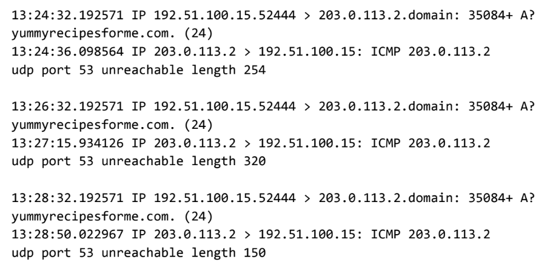

Text can be **bold**, _italic_, ~~strikethrough~~ or `keyword`.

[Link to another page](./another-page.html).

There should be whitespace between paragraphs.

There should be whitespace between paragraphs. We recommend including a README, or a file with information about your project.

## Professional Statement

My name is Christian. I am a highly motivated and detail-oriented technical support and cybersecurity professional with a passion for protecting sensitive data and mitigating cyber threats while providing top tier customer support. I am committed to safeguarding company data and maintaining the integrity of digital infrastructures in a forward-thinking organization. I am passionate about staying ahead of the curve in the evolving landscape of cyber threats. I am very eager to bring my knowledge of encryption algorithms and intrusion detection systems to a dynamic cybersecurity team.


# Security Audit for Botium Toys

Conducted a security audit by implementing the NIST CSF, establishing an audit scope and goals, listing assets currently managed by the IT department, and completing a risk assessment. Implemented PCI DSS, GDPR, SOC type 1, and SOC type2 compliances

[Controls and Compliance Checklist](https://github.com/xtiannd/xtiannd.github.io/blob/main/Controls%20and%20compliance%20checklist.pdf)

# Analyzed Network Layer Communication

Several customers of clients reported that they were not able to access the client company website www.yummyrecipesforme.com, and saw the error “destination port unreachable” after waiting for the page to load. 

I was tasked with analyzing the situation and determining which network protocol was affected during this incident. To start, I attempted to visit the website and also received the error “destination port unreachable.” To troubleshoot the issue, I loaded my network analyzer tool, tcpdump, and attempt to load the webpage again. To load the webpage, my browser sends a query to a DNS server via UDP to retrieve the IP address for the website's domain name. It uses this IP address as the destination IP for sending an HTTPS request to the web server to display the webpage  The analyzer shows that when you send UDP packets to the DNS server, you receive ICMP packets containing the error message: “udp port 53 unreachable.” 



In the DNS and ICMP log, I found the following information: 

1. The first two lines of the log file show the initial outgoing request from your computer to the DNS server requesting the IP address of yummyrecipesforme.com. This request is sent in a UDP packet.

1. The second and third lines of the log show the response to your UDP packet. In this case, the ICMP 203.0.113.2 line is the start of the error message indicating that the UDP packet was undeliverable to port 53 of the DNS server.

1. In front of each request and response, you find timestamps that indicate when the event happened. In the log, this is the first sequence of numbers displayed: 13:24:32.192571. This means the time is 1:24 p.m., 32.192571 seconds.

1. After the timestamps, you will find the source and destination IP addresses. In the first line, where the UDP packet travels from your browser to the DNS server, this information is displayed as: 192.51.100.15.52444 > 203.0.113.2.domain. The IP address to the left of the greater than (>) symbol is the source address, which in this example is your computer’s IP address. The IP address to the right of the greater than (>) symbol is the destination IP address. In this case, it is the IP address for the DNS server: 203.0.113.2.domain

1. After the source and destination IP addresses, there can be a number of additional details like the protocol, port number of the source, and flags. In the first line of the error log, the query identification number appears as: 35084. The plus sign after the query identification number indicates there are flags associated with the UDP message. The "A?" indicates a flag associated with the DNS request for an A record, where an A record maps a domain name to an IP address. The third line displays the protocol of he response message to the browser: "ICMP," which is followed by an ICMP error message

1. The error message, "udp port 53 unreachable" is mentioned in the last line. Port 53 is a port for DNS service. The word "unreachable" in the message indicates the UDP message requesting an IP address for the domain "www.yummyrecipesforme.com" did not go through to the DNS server because no service was listening on the receiving DNS port.

1. The remaining lines in the log indicate that ICMP packets were sent two more times, but the same delivery error was received both times.

My follow up report: 

[Cybersecurity Incident Report](https://github.com/xtiannd/xtiannd.github.io/blob/main/Cybersecurity%20incident%20report%20network%20traffic%20analysis.pdf)


> This is a blockquote following a header.
>
> When something is important enough, you do it even if the odds are not in your favor.

#### Header 4

```js
// Javascript code with syntax highlighting.
var fun = function lang(l) {
  dateformat.i18n = require('./lang/' + l)
  return true;
}
```

```ruby
# Ruby code with syntax highlighting
GitHubPages::Dependencies.gems.each do |gem, version|
  s.add_dependency(gem, "= #{version}")
end
```

#### Header 4

*   This is an unordered list following a header.
*   This is an unordered list following a header.
*   This is an unordered list following a header.

##### Header 5

1.  This is an ordered list following a header.
2.  This is an ordered list following a header.
3.  This is an ordered list following a header.

###### Header 6

| head1        | head two          | three |
|:-------------|:------------------|:------|
| ok           | good swedish fish | nice  |
| out of stock | good and plenty   | nice  |
| ok           | good `oreos`      | hmm   |
| ok           | good `zoute` drop | yumm  |

### There's a horizontal rule below this.

* * *

### Here is an unordered list:

*   Item foo
*   Item bar
*   Item baz
*   Item zip

### And an ordered list:

1.  Item one
1.  Item two
1.  Item three
1.  Item four

### And a nested list:

- level 1 item
  - level 2 item
  - level 2 item
    - level 3 item
    - level 3 item
- level 1 item
  - level 2 item
  - level 2 item
  - level 2 item
- level 1 item
  - level 2 item
  - level 2 item
- level 1 item

### Small image


### Large image


### Definition lists can be used with HTML syntax.

<dl>
<dt>Name</dt>
<dd>Godzilla</dd>
<dt>Born</dt>
<dd>1952</dd>
<dt>Birthplace</dt>
<dd>Japan</dd>
<dt>Color</dt>
<dd>Green</dd>
</dl>

```
Long, single-line code blocks should not wrap. They should horizontally scroll if they are too long. This line should be long enough to demonstrate this.
```

```
The final element.
```
